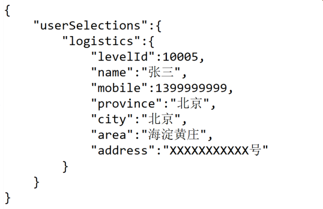

## 创建地址接口
+ 功能说明：创建地址

### 历史记录

#### 2019-12-03 
- 支付成功后前端将物流信息放入userSelections.logistics中<br/>



{
    "userSelections":{
        "logistics":{
            "levelId":10005,
            "name":"张三",
            "mobile":1399999999,
            "province":"北京",
            "city":"北京",
            "area":"海淀黄庄",
            "address":"XXXXXXXXXXX号"
        }
    }
}

#### 2019-12-03 
- 新增

**公共参数:**
+ 测试接口的地址为 https://test-msyb-cms-api.qingclasswelearn.com/logistics/create
+ 线上接口的地址为 https://msyb-cms-api.qingclasswelearn.com/logistics/create
+ 公共参数 说明： 公共参数需要传递到get或post里面，get请求参数都传到参数中，post请求参数都传到form中。

### 接口信息
|接口调用方式 	|	Restful Service			|
|:--------------|:--------------------------|
|功能	     	| 创建地址					|
|接口名称		|/logistics/create			|
|请求方法		|POST					    |

### 接口公共参数
|参数名		   		|类型	|是否必填	|说明			    					|
|:------------------|:------|:----------|:--------------------------------------|
|levelId			|Integer|是		  	|levelId								|
|name				|String |是		  	|姓名									|
|mobile				|String |是		  	|手机									|
|province			|String |是		  	|省										|
|city				|String |是		  	|市										|
|area				|String |是		  	|区										|
|address			|String |是		  	|地址									|

### 接口返回值
+ 返回值数据类型：json
+ 返回值说明：

**返回值**  

```
{
    "denied": false,
    "success": true,
    "data": {}
}
```

**返回值描述**  

```
content:错误描述
```